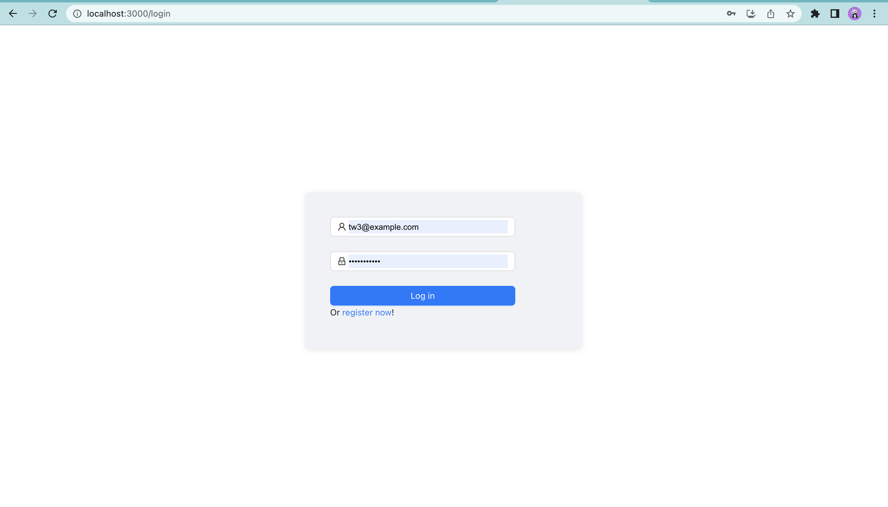

# online-scheduler
A online scheduler
* The frontend and backend components are designed to run independently.
* Backend 
  * uses Spring Boot for running the web app.
  * uses Spring Security and JWT for authorization.
  * uses Spring JPA for object mapping.
* Frontend
  * uses React.
* Database
  * MySQL

# How to start
## Backend
* Run the `src/main/java/com/example/onlineschedule/OnlineSchedulingAndReservationSystemApplication.java` to start the spring backend.
* The backend runs on http://localhost:8080

## Frontend
* First, go the `frontend/online-scheduler`,
* use `npm install` to install all dependencies.
* use `npm start` to start the react app.
* the frontend runs on http://localhost:3000

# Introduction
## Log in

* this is log in page that users could log in to their own appointment page.

## Sign Up

* this is sign up page that user could sign up as a new user.

## Scheduler

This is main scheduler page, and has a few function:
* The upper right corner icon, user could check their email and log out.
* Make a appointment. (the system will reminds you if the appointment is invalid)
* The bottom is the user's current appointments, and user could change the schedule view of table and a real calender.
